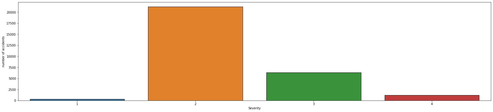
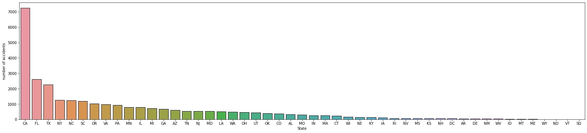

# Project 2: US Vehicle Accidents EDA (Python)

This repository is for the analysis done on the Kaggle: US Vehicle Accidents dataset. Below you will find an overview of the data, code, and results. The goal of this project was to perform an exploratory data analysis (which included the use of GeoPandas) and to prepare (i.e., clean and impute) for future predictive modeling use.

## Vehicle Accidents Dataset

The dataset was gathered from [Kaggle](https://www.kaggle.com/sobhanmoosavi/us-accidents) and, at the time of collection, spanned from February 2016 to December 2020. The dataset contained 47 variables and 2,906,610 accident records.

### Variables

`ID`, `Severity`, `Start_Time`, `End_Time`, `Start_Lat`, `Start_Lng`, `End_Lat`, `End_Lng`, `Distance(mi)`, `Description`, `Number`, `Street`, `Side`, `City`, `County`, `State`, `Zipcode`, `Country`, `Timezone`, `Airport_Code`, `Weather_Timestamp`, `Temperature(F)`, `Wind_Chill(F)`, `Humidity(%)`, `Pressure(in)`, `Visibility(mi)`, `Wind_Direction`, `Wind_Speed(mph)`, `Precipitation(in)`, `Weather_Condition`, `Amenity`, `Bump`, `Crossing`, `Give_Way`, `Junction`, `No_Exit`, `Railway`, `Roundabout`, `Station`, `Stop`, `Traffic_Calming`, `Traffic_Signal`, `Turning_Loop`, `Sunrise_Sunset`, `Civil_Twilight`, `Nautical_Twilight`, `Astronomical_Twilight`

<table>
  
| **Variable** | **Number of Null Values** | **Percentage of Variable Data** |
| :-: | :-: | :-: |
| End_Lat | 282821 | 9.73% |
| End_Lng | 282821 | 9.73% |
| Number | 1891672 | 65.08% |
| City | 108 | 0.0037% |
| Zipcode | 1114 | 0.038% |
| Timezone | 3430 | 0.12% |
| Airport_Code | 6608 | 0.23% |
| Weather_Timestamp | 46917 | 1.61% |
| Temperature(F) | 67224 | 2.31% |
| Wind_Chill(F) | 1183859 | 40.73% |
| Humidity(%) | 71270 | 2.45% |
| Pressure(in) | 56908 | 1.96% |
| Visibility(mi) | 72078 | 2.48% |
| Wind_Direction | 63474 | 2.18% |
| Wind_Speed(mph) | 307163 | 10.57% |
| Precipitation(in) | 1301326 | 44.77% |
| Weather_Condition | 71851 | 2.47% |
| Sunrise_Sunset | 110 | 0.0038% |
| Civil_Twilight | 110 | 0.0038% |
| Nautical_Twilight | 110 | 0.0038% |
| Astronomical_Twilight | 110 | 0.0038% |
  
</table>

## us-accidents.ipynb

This is the Jupyter Notebook which contains the exploratory data analysis, data cleaning, and data engineering which was performed on Kaggle.

## Results

### EDA

I looked at distribution of data using histograms and bar plots. A correlation heatmap was used to find relationships between the numeric data. GeoPandas was used to explore geographic features. Below are some of the highlights from the exploratory data analysis.
  
<figure>

  <figcaption></figcaption>
</figure>

<figure>

  <figcaption></figcaption>
</figure>

### Data Cleaning

I cleaned the data to make the dataset usable for future modeling. I made the following changes:

## Applications

## Resources

1. [Kaggle: US Accidents (3 million records -- updated)](https://www.kaggle.com/sobhanmoosavi/us-accidents)
2. [DiTomaso Law: Cherry Hill Car Accident Lawyers](https://www.ditomasolaw.com/practice-areas/car-accidents/multi-vehicle-auto-accidents/)
