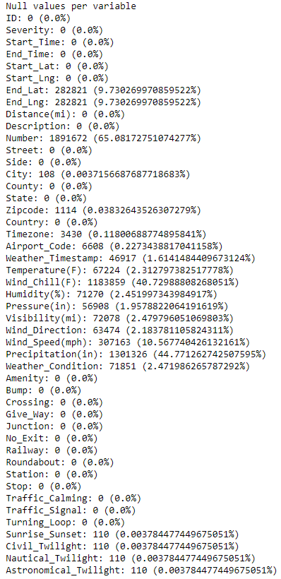

# Project 2: US Vehicle Accidents EDA (Python)

This repository is for the analysis done on the Kaggle: US Vehicle Accidents dataset. Below you will find an overview of the data, code, and results. The goal of this project was to perform an exploratory data analysis (which included the use of GeoPandas) and to prepare (i.e., clean and impute) for future predictive modeling use.

## Vehicle Accidents Dataset

The dataset was gathered from [Kaggle](https://www.kaggle.com/sobhanmoosavi/us-accidents) and, at the time of collection, spanned from February 2016 to December 2020. The dataset contained 47 variables and 2,906,610 accident records.

### Variables

`ID`, `Severity`, `Start_Time`, `End_Time`, `Start_Lat`, `Start_Lng`, `End_Lat`, `End_Lng`, `Distance(mi)`, `Description`, `Number`, `Street`, `Side`, `City`, `County`, `State`, `Zipcode`, `Country`, `Timezone`, `Airport_Code`, `Weather_Timestamp`, `Temperature(F)`, `Wind_Chill(F)`, `Humidity(%)`, `Pressure(in)`, `Visibility(mi)`, `Wind_Direction`, `Wind_Speed(mph)`, `Precipitation(in)`, `Weather_Condition`, `Amenity`, `Bump`, `Crossing`, `Give_Way`, `Junction`, `No_Exit`, `Railway`, `Roundabout`, `Station`, `Stop`, `Traffic_Calming`, `Traffic_Signal`, `Turning_Loop`, `Sunrise_Sunset`, `Civil_Twilight`, `Nautical_Twilight`, `Astronomical_Twilight`

## us-accidents.ipynb

This is the Jupyter Notebook which contains the exploratory data analysis, data cleaning, and data engineering which was performed on Kaggle.

## Results and Application

### EDA

<figure>

  <figcaption></figcaption>
</figure>

<figure>

  <figcaption></figcaption>
</figure>

<figure>

  <figcaption></figcaption>
</figure>

### Application

## Resources

1. [Kaggle: US Accidents (3 million records -- updated)](https://www.kaggle.com/sobhanmoosavi/us-accidents)
2. [DiTomaso Law: Cherry Hill Car Accident Lawyers](https://www.ditomasolaw.com/practice-areas/car-accidents/multi-vehicle-auto-accidents/)
