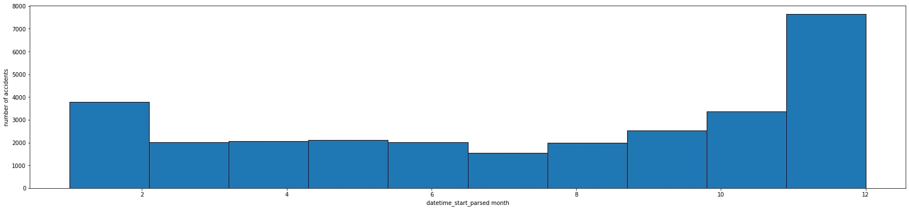

# Project 2: US Vehicle Accident Severity EDA and Data Cleaning (Python/Jupyter Notebook)

This repository is for the analysis done on the Kaggle: US Vehicle Accidents dataset. Below you will find an overview of the data, code, and results. The goal of this project was to perform an exploratory data analysis and to prepare the data (i.e., clean and feature engineer) for future predictive modeling use.

### Code Used 

**Python Version:** 3.7.10 <br />
**Packages:** pandas, numpy, sklearn, matplotlib, seaborn, warnings, datetime, geopandas, geoplot, scipy <br />
**For Web Framework Requirements:**  ```pip install -r requirements.txt```  

## Vehicle Accidents Dataset

The dataset was gathered from [Kaggle](https://www.kaggle.com/sobhanmoosavi/us-accidents) and, at the time of collection, spanned from February 2016 to December 2020. The dataset contained 47 variables and 2,906,610 accident records.

### Variables

`ID`, `Severity`, `Start_Time`, `End_Time`, `Start_Lat`, `Start_Lng`, `End_Lat`, `End_Lng`, `Distance(mi)`, `Description`, `Number`, `Street`, `Side`, `City`, `County`, `State`, `Zipcode`, `Country`, `Timezone`, `Airport_Code`, `Weather_Timestamp`, `Temperature(F)`, `Wind_Chill(F)`, `Humidity(%)`, `Pressure(in)`, `Visibility(mi)`, `Wind_Direction`, `Wind_Speed(mph)`, `Precipitation(in)`, `Weather_Condition`, `Amenity`, `Bump`, `Crossing`, `Give_Way`, `Junction`, `No_Exit`, `Railway`, `Roundabout`, `Station`, `Stop`, `Traffic_Calming`, `Traffic_Signal`, `Turning_Loop`, `Sunrise_Sunset`, `Civil_Twilight`, `Nautical_Twilight`, `Astronomical_Twilight`

<div align="center">
<table>
  
| **Variable** | **Number of Null Values** | **Percentage of Variable Data** |
| :-: | :-: | :-: |
| End_Lat | 282821 | 9.73% |
| End_Lng | 282821 | 9.73% |
| Number | 1891672 | 65.08% |
| City | 108 | 0.0037% |
| Zipcode | 1114 | 0.038% |
| Timezone | 3430 | 0.12% |
| Airport_Code | 6608 | 0.23% |
| Weather_Timestamp | 46917 | 1.61% |
| Temperature(F) | 67224 | 2.31% |
| Wind_Chill(F) | 1183859 | 40.73% |
| Humidity(%) | 71270 | 2.45% |
| Pressure(in) | 56908 | 1.96% |
| Visibility(mi) | 72078 | 2.48% |
| Wind_Direction | 63474 | 2.18% |
| Wind_Speed(mph) | 307163 | 10.57% |
| Precipitation(in) | 1301326 | 44.77% |
| Weather_Condition | 71851 | 2.47% |
| Sunrise_Sunset | 110 | 0.0038% |
| Civil_Twilight | 110 | 0.0038% |
| Nautical_Twilight | 110 | 0.0038% |
| Astronomical_Twilight | 110 | 0.0038% |
  
</table>
</div>

## us-accidents.ipynb

This is the Jupyter Notebook which contains the exploratory data analysis, data cleaning, and feature engineering which was performed on [Kaggle](https://www.kaggle.com/michaelbryantds/us-accidents-eda-and-preprocessing).

## Results

### EDA

I looked at the distribution of data using histograms and bar plots. A correlation heatmap was used to find relationships between the numeric data. GeoPandas was used to explore geographic features. Below are some of the highlights from the exploratory data analysis. For these visualizations, a sample of the data was used due to the dataset being 1 GB in size.

According to Figure 1, accidents are most likely to be reported with a severity of 2 (where 1 is least severe and 4 is most). Figure 2 is useful for visualizing where accidents occur. It is similar to a population density map with the exception of the freeway systems where accidents are likely due to high speeds.


<div align="center">
  
<figure>

  <figcaption>Figure 1: Histogram of accident severity</figcaption>
</figure>
<br/><br/>
  
</div>

<div align="center">

<figure>

  <figcaption>Figure 2: US map with accidents where hue indicates severity</figcaption>
</figure>
<br/><br/>

</div>

Figures 3 through 6 reinforce the idea that accidents are most likely to occur in populated areas and on freeways where Los Angeles county has the most accidents of any US county, Houston and Los Angeles are the cities where accidents are most likely to occur, and the west coast's I-5 is the freeway with the most accidents.

<div align="center">

<figure>

  <figcaption>Figure 3: Histogram of US states with most accidents</figcaption>
</figure>
<br/><br/>

</div>

<div align="center">

<figure>

  <figcaption>Figure 4: Histogram of US counties with most accidents</figcaption>
</figure>
<br/><br/>

</div>

<div align="center">

<figure>

  <figcaption>Figure 5: Histogram of US cities with most accidents</figcaption>
</figure>
<br/><br/>

</div>

<div align="center">

<figure>

  <figcaption>Figure 6: Histogram of US streets with most accidents</figcaption>
</figure>
<br/><br/>

</div>

The most interesting find of the analysis was that accidents are increasing each year and are doing so non-linearly with the inclusion of 2020 as shown in Figure 7. The only explanation I could find for this was that the streets were less crowded due to COVID-19 lockdowns causing drivers to drive at higher speeds.

<div align="center">

<figure>

  <figcaption>Figure 7: Histogram of year for accidents indicated an increase of accidents over time</figcaption>
</figure>
<br/><br/>

</div>

According to Figures 8 and 9, accidents are most likely to occur in Janurary and Decemeber at around 8 AM and at 4 PM.

<div align="center">

<figure>

  <figcaption>Figure 8: Histogram of month for accidents indicating accidents are more likely to occur during January and Decemeber than any other month</figcaption>
</figure>
<br/><br/>

</div>

<div align="center">

<figure>

  <figcaption>Figure 9: Histogram of hour for accidents indicating accidents are more likely to occur mid-morning or mid-afternoon</figcaption>
</figure>
<br/><br/>

</div>

Figures 10 and 11 show that the most common weather conditions to get in an accident in is fair and clear with no wind.

<div align="center">

<figure>

  <figcaption>Figure 10: Histogram of weather conditions for accidents indicating accidents are most likely to occur during non-extreme conditions</figcaption>
</figure>
<br/><br/>

</div>

<div align="center">

<figure>

  <figcaption>Figure 11: Histogram of wind direction for accidents indicating accidents are most likely to occur with no wind present</figcaption>
</figure>
<br/><br/>

</div>

Finally, the correlation heatmap for the numeric variables in Figure 12 indicates low correlations between variables besides for latitude and longitude. The only exception being temperature and wind chill where it is almost exactly a linear relationship at 0.99 correlation.

<div align="center">

<figure>

  <figcaption>Figure 12: Correlation heatmap for numeric data showing low correlations with most variables</figcaption>
</figure>
  
</div>

### Data Cleaning

I cleaned the data to make the dataset usable for future modeling. I made the following changes:
* Replaced missing `Side` value with mode
* Combined multiple `Weather_Condition` descriptions due to similarity
  * Replaced 'N/A Precipitation' with mode
* Made `Wind_Direction` entry notation consistent
* Made all `Zipcode` entries five digits
* Removed `ID` and `Number`
* Imputed missing `City` and `Zipcode` data using geolocator and lat/lng
  * If `Zipcode` data could not be located then missing values were replaced with the mode for the state
* Imputed missing `Airport_Code` data with the mode for the state
* Imputed missing `Timezone` data using timezonerfinder and lat/lng
* Imputed missing `End_Lat` and `End_Lng` data using `Start_Lat` and `Start_Lng` data, respectively
* Imputed missing `Wind_Chill(F)` data using `Temperature(F)` data, and vice versa
  * Imputed remaining `Temperature(F)` and `Wind_Chill(F)` data with median
* Imputed missing `Weather_Timestamp` data with `End_Time` data
* Imputed missing `Humidity(%)`, `Pressure(in)`, `Visibility(mi)`, `Wind_Speed(mph)`, and `Precipitation(in)` data with median
* Imputed missing `Wind_Direction`, `Weather_Condition`, `Sunrise_Sunset`, `Civil_Twilight`, `Nautical_Twilight`, and `Astronomical_Twilight` data with mode


### Feature Engineering

I feature engineered using the dataset for future modeling. I made the following changes:
* Seperated datetime data into seperate columns for day, month, year, hour, minute, and second for `Start_Time`, `End_Time`, and `Weather_Timestamp`
* Created two columns for the absolute values of the changes in longitude and latitude using `End_Lng`, `Start_Lng`, `End_Lat`, and `Start_Lat`
 
## Applications

The visualizations from this project can be used to create reports for city planners for reaccessing speed limits and road design based on accident severity, frequency, and typical weather conditions during these accidents. The prepared data from this project can be used to predict the severity of an accident given the location, date, time, and weather conditions. An application of this is to ensure emergency responders are prepared to handle severe accidents. This would be similar to wildfire warnings for fire departments, but instead this model would output accident severity warnings to emergency medical services. To productionize this, you could scan over an area using longitude and latitude, and assign a severity measurement to each point given the date, time, and forecasted weather conditions. The output could be a severity density map of the specified region.

## Resources

1. [Kaggle: US Accidents (3 million records -- updated)](https://www.kaggle.com/sobhanmoosavi/us-accidents)
2. [GitHub: PlayingNumbers - ds_salary_proj](https://github.com/PlayingNumbers/ds_salary_proj)
